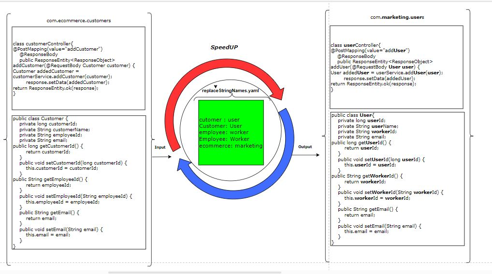

# speedUP

The objective of this tool is to speedUP your app/api development process and to make it smooth. Being in the IT industry, developers experience a lot of repetative work which takes a lot of time and also leads to a loss of interest due to the monotony. To help with this I have developed a tool(speedUp.jar). Using this tool we will be able to generate a copy of our code with the new desired values and with minimal efforts, all  with just a single 'click'!
 Processing of the jar is depicted in the below diagram.
 Note:This tool is not specific to any language like Java/Python. it works for all files/direcories except encrypted/compressed file.

Diagram of detailed processing given below.

# Requirement

Your must have Java8 installed in your device.

# Follow the following simple steps to generate the copy of your work:-

Step 1. Download speedUP from (https://github.com/Shabi-Anwar-Baig/speedUp)

Step 2. Unzip speedUP-main.

Step 3. Copy "speedUP-main" in your C drive / Linux Users will copy "speedUP-main" in "/home/" .

Step 4. Go to into "C:\speedUP-main\configuration" / Linux Users Go to into "/home/speedUP-main/configuration" .

Step 5. Enter your git credentials in "gitCredentials.yaml".

Step 6. Add your SOURCE and DESTINATION link in "outPutLocation.yaml".

Step 7. Add the key values in "replaceStringNames.yaml" (on the Left side will be Old Values and on Right side will be New Values, separated by a colon: ). Kindly note- this will rename your files, file references and directory according to your input.

Step 8. Go to into "C:\speedUP-main\speedUP-main" / Linux Users Go to into "/home/speedUP-main", open cmd prompt then run java -jar SpeedUP.jar/java -jar SpeedUp-Linux.jar  <b> wait for a few seconds. </b> The new directory will get generated according to destinationDirectoryPath which exists in "gitCredentials.yaml"

Follow the above steps to generate a copy of code with new values from git and the same thing can be done in order to generate code from the local machine also after modifying the file - "C:\speedUP-main\speedUP-main\configuration\inputType.yaml" / "/home/speedUP-main/speedUP-main/configuration/inputType.yaml" . Change  "gitFlag: yes" to "gitFlag: no" and add your local code path in "outPutLocation.yaml" instead of Git repo link.

<b>Humble request to all to please try this tool and send your feedback so that it can be improved further to serve us all.</b>

Happy learning....!
